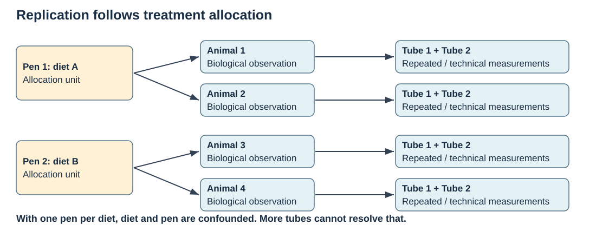

## Learning objectives

Define experimental units and independent replication; distinguish randomisation, blocking and batch adjustment; identify confounded designs and specify sample handling.

## Visualize the allocation unit



Use the [visual guide](../visual_guide.qmd) to explain the assumptions in this diagram.

## Biological question and measurements

For an individually allocated diet, the animal can be the experimental unit. If a diet is allocated to pens, animals within a pen are not independent diet allocations: the pen is the unit for the intervention. Sequencing lanes, aliquots and repeated measurements are technical or within-unit observations, not additional biological replicates.

A multi-omics study should connect animal identity to tissue, collection time, storage, extraction, assay and batch. Collection and preservation requirements differ across molecules; a shared animal identifier does not imply that one preparation is appropriate for every assay. Predefine exclusion rules and the primary contrast. Where possible, randomise treatment allocation, blind handling and distribute biological groups across processing batches.

## Model and assumptions

A simple fixed-effect model is $y_i=\beta_0+\beta_T T_i+\beta_B B_i+e_i$. Its design matrix X must have independent columns to separate treatment and batch. If every control is in batch A and every treatment in batch B, the two effects are not separately identifiable. Increasing the number of observations in the same confounded arrangement does not solve this.

Blocking balances treatments within a known nuisance factor; batch adjustment models remaining variation. Neither creates the missing comparisons in a perfectly confounded design.

## Worked example

The inputs below are hypothetical. Run the example, predict one change, then compare your prediction with the result. All executable code uses base R.

```{r}
balanced <- data.frame(treatment=factor(rep(c("control","treated"),4)),
 batch=factor(rep(c("A","A","B","B"),2)))
confounded <- transform(balanced, batch=treatment)
rank_info <- function(d) {
 X <- model.matrix(~ treatment + batch, d)
 c(columns=ncol(X), rank=qr(X)$rank)
}
rbind(balanced=rank_info(balanced), confounded=rank_info(confounded))
stopifnot(qr(model.matrix(~treatment+batch, balanced))$rank==3,
          qr(model.matrix(~treatment+batch, confounded))$rank==2)
```

The balanced design supplies independent treatment and batch columns. The confounded model has three columns but only rank two: software cannot recover the absent information.

## Plan allocation, sampling and processing separately

Random allocation concerns the biological intervention. Randomized processing order concerns how samples encounter technical conditions. These operations protect different comparisons. A biologically randomized study can still have diet perfectly confounded with extraction day; randomizing extraction alone does not make an observational exposure a randomized intervention.

Blocking forms comparisons within a known source of variation, such as farm or baseline weight class. For a balanced two-diet study, both diets should occur within the relevant block where feasible. Record the actual allocation, not just the intended schedule. Blinding helps prevent group knowledge from influencing handling or interpretation; it does not remove differences already present in a design.

A sample sheet should connect subject, biological specimen and assay aliquot. Keep repeated times explicit. The same animal can supply several samples, and one specimen can supply several technical preparations. A missing assay is not the same as an animal excluded from the whole experiment.

## Replication, dependence and effective information

For equal clusters with $m$ animals per pen and within-pen correlation $\rho$, the variance inflation for a simple average relative to independent animals is $D=1+(m-1)\rho$. This is an illustrative equal-correlation model, not a substitute for specifying the treatment unit and fitting an appropriate analysis.

```{r}
m <- c(1,5,10,20)
rho <- .2
data.frame(animals_per_pen=m,design_effect=1+(m-1)*rho,
 information_relative_to_independence=1/(1+(m-1)*rho))
```

When diet is assigned to pens, precision of its comparison depends strongly on the number of independent pens. More animals per pen can improve measurement of a pen response but cannot create new treatment allocations. The same reasoning explains why technical duplicate libraries cannot replace missing biological replicates.

## Balance and precision are different checks

A full-rank design can be highly unbalanced. Sparse cells create uncertain comparisons even when a coefficient exists. Inspect counts within treatment-by-batch combinations, then ask whether the target contrast relies on a small subgroup.

```{r}
layout <- data.frame(group=factor(rep(c('C','T'),c(9,3))),
 batch=factor(c(rep('A',5),rep('B',4),'A','B','B')))
xtabs(~group+batch,layout)
X <- model.matrix(~group+batch,layout)
stopifnot(qr(X)$rank==ncol(X))
# With independent residual variance one, diagonal entries describe
# coefficient variances under this particular fixed design.
diag(solve(crossprod(X)))
```

This calculation conditions on the supplied linear model and residual variance. It shows where design information enters uncertainty, without providing a universal recommended sample count.

## Specify exclusions and missingness before seeing effects

An independently justified failed-assay rule is different from removing a sample because it weakens the desired contrast. Record the reason, when it was identified, affected assays and sensitivity of conclusions. If treatment changes survival or sample availability, the remaining observations may represent a selected subset rather than the original population.

Power planning needs a biologically meaningful effect, relevant variability, allocation structure, assay reliability and a multiplicity strategy. Sensitivity calculations across plausible inputs are more informative than a single optimistic number. Pilot variance estimates can themselves be uncertain. A design decision should also consider animal welfare, collection burden and feasible independent replication.

::: {.callout-note collapse="true" title="Design challenge"}
Two farms each receive only one diet. Is farm adjustment sufficient? No: there is no within-farm treatment comparison. If each farm instead has independently allocated pens receiving both diets, the design supplies comparisons, although pen dependence and the small number of farms still matter for generalization.
:::

## Interpretation and scope

Rank is necessary, not sufficient, for a good experiment. Power, within-unit dependence, transport/storage effects, selection and missingness still matter. Plan biological replication using a relevant effect size and variance, not a universal sample-count rule. See the [NC3Rs experimental-unit guidance](https://eda.nc3rs.org.uk/experimental-design-unit) for examples.

## Exercises

1. A diet is assigned to four pens, with ten animals per pen. What is the diet experimental unit?
2. Can adjustment rescue a treatment–batch confounding problem?
3. What must a matched multi-omics sample sheet record?

::: {.callout-note collapse="true" title="Suggested answers"}
1. The pen; ten animals provide within-pen measurements rather than ten allocations.
2. Not when treatment and batch are perfectly confounded.
3. Animal, specimen, tissue, time, treatment, handling, assay and batch, plus explicit mappings between assay and biological sample identifiers.
:::

## Further reading

Use the [NC3Rs experimental-unit guidance](https://eda.nc3rs.org.uk/experimental-design-unit) alongside the design practical. Compare its allocation examples with your own animal, pen and repeated-sampling hierarchy.

## Practicals and course pathways

[Design practical](../tutorials/p15_experimental_design.qmd) and [sample identity](../tutorials/p14_data_handling.qmd) supply shared foundations for both pathways.

Use the [unified map](../course_map.qmd) to locate B02 in both harmonized outlines. Return to the [building-block index](../modules.qmd).
