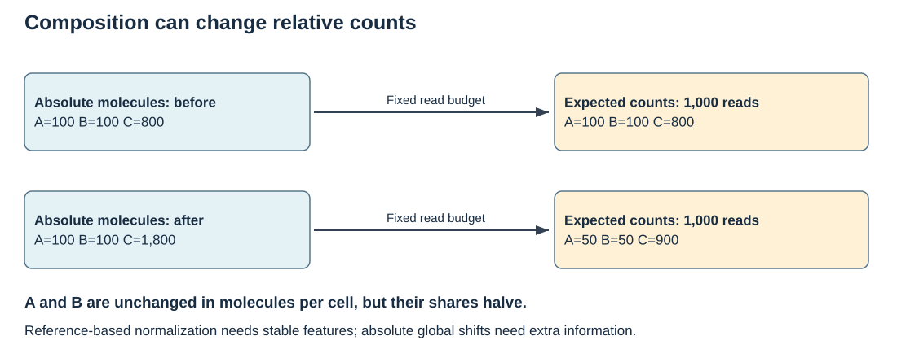

## Learning objectives

After working through this module and its practical, you should be able to:

- Explain what bulk RNA-seq measures and how cell composition affects interpretation.
- Follow the route from sampled tissue to a gene-by-sample count matrix.
- Distinguish sequencing depth, composition normalization and adjustment for batch.
- Interpret a count-model offset, dispersion, treatment contrast and confidence interval.
- Use exploratory plots and diagnostics to ask questions about sample quality.
- Report differential-expression evidence without equating significance with biological importance or causality.

## Visualize the composition problem



Use the [visual guide](../visual_guide.qmd) to explain the assumptions in this diagram. Apply the model to [actual paired RNA-seq counts](../tutorials/c01_airway.qmd).

## 1. Start with the biological comparison

Imagine a feeding experiment asking whether a supplement changes transcription in liver tissue. The question must identify the animals, tissue, collection time and comparison. A sample collected after a meal may answer a different question from a fasting sample. Differences between tissues can be much larger than the treatment effect of interest.

Bulk RNA-seq pools RNA from the cells present in a sample. Higher abundance of an immune-cell transcript could reflect more immune cells, more transcription per immune cell, or both. Even an accurately estimated tissue-level difference does not distinguish these explanations by itself. RNA abundance also need not predict protein abundance: translation, degradation and collection timing intervene between the two measurements.

The experimental unit follows treatment allocation. If diet is independently assigned to animals, animals provide biological replication. If diet is assigned to pens, animals within a pen share the treatment unit; treating all animals as independent treatment replicates can exaggerate precision. More sequencing reads improve measurement of a library, but do not create additional animals or pens. Repeated tissues from one animal require their dependence to be considered.

::: {.callout-tip title="Define the target before analysing"}
Write a sentence such as: “Compare liver transcript abundance between supplemented and control animals at the specified collection time, accounting for processing batch.” Then ask whether the allocation, sampling and metadata support that sentence.
:::

## 2. From tissue to count matrix

The measurement passes through several stages. At each stage, retain the information needed to explain the resulting counts.

| Stage | What happens | What can change interpretation? |
|---|---|---|
| Sampling | Tissue is collected and stored | Time, tissue region, cell mixture, RNA degradation |
| Library preparation | RNA is selected and converted into a sequencing library | Selection protocol, strandedness, preparation batch |
| Sequencing | Fragments are represented by sequence reads | Depth, base quality, contamination |
| Alignment or quantification | Reads are related to a reference | Reference assembly, annotation version, ambiguous mapping |
| Feature summarization | Evidence is assigned to genes or transcripts | Counting rules, overlapping features, transcript aggregation |
| Statistical analysis | Replicated samples are compared | Design, normalization, dispersion and contrast |

For paired-end data, the two reads usually describe the ends of one fragment. The counting convention should make clear whether the output counts fragments or reads. Gene-level summarization combines evidence from transcripts, so a change in isoform usage may be obscured by an unchanged total gene count. A count matrix is therefore already a processed measurement, not a direct census of RNA molecules.

Rows should have stable feature identifiers and columns should have unique sample identifiers. Match sample names explicitly to metadata. Keep the reference and annotation versions: changing annotation can alter which reads are assigned to a gene even if the biological samples are unchanged.

## 3. Depth and composition are different problems

### Known exposure

A convenient teaching model is that expected count equals exposure times abundance:

$$\mu_{gj}=s_j q_{gj}.$$

Here $g$ indexes genes, $j$ indexes samples, $s_j$ describes relative exposure and $q_{gj}$ is the expected count at unit exposure. If exposure doubles while abundance is unchanged, expected count doubles. Dividing counts by known exposure gives a useful descriptive comparison, although the counts still have sampling variation.

The following hypothetical calculation isolates this relationship:

```{r}
counts <- c(80,120,160)
exposure <- c(.8,1.2,1.6)
data.frame(counts,exposure,adjusted=counts/exposure)
stopifnot(all(counts/exposure==100))
```

### Composition

Actual libraries are sampled from a mixture of transcripts. If a few transcripts occupy much more of a library, other transcripts can receive a smaller fraction of reads even when their abundance per cell is unchanged. Scaling by the total count cannot establish an absolute abundance scale.

```{r}
# Hypothetical molecule abundances; only gene A changes.
molecules <- cbind(control=c(A=100,B=100,C=100),
                  supplement=c(A=400,B=100,C=100))
fractions <- sweep(molecules,2,colSums(molecules),"/")
expected_counts <- 600*fractions
round(expected_counts,1)
data.frame(gene=rownames(molecules),
 true_ratio=molecules[,2]/molecules[,1],
 observed_fraction_ratio=fractions[,2]/fractions[,1])
stopifnot(molecules["B",2]==molecules["B",1],
          fractions["B",2]<fractions["B",1])
```

Gene B appears reduced on the fraction scale despite unchanged molecule abundance. This deliberately extreme example shows why the normalization reference matters. Methods based on a set of relatively stable genes require assumptions about that reference. External controls can help address some questions, but their interpretation depends on when and how they were added. A control added per mass of extracted RNA does not automatically provide RNA abundance per cell.

### Choose the scale for the question

| Quantity | Useful question | Main limitation |
|---|---|---|
| Raw counts | How much evidence was assigned to a feature? | Exposure differs between samples |
| CPM | What share of counted evidence belongs to a feature? | Sensitive to library composition |
| TPM | How is length-adjusted abundance distributed within a sample? | Relative scale; not direct input to a standard raw-count model |
| Normalized counts | How does a gene compare across samples under a normalization reference? | Depends on the normalization assumptions |
| Transformed expression | How do samples or expression patterns relate descriptively? | Transformation is not itself a differential-expression test |

Gene length matters when comparing different genes' abundance. For the same gene across samples, a fixed length alone does not explain a treatment difference. Transcript usage and sample-specific effective length can complicate that simplification.

## 4. Count models and biological variation

A Poisson model assumes variance equals the mean. Independent biological samples often vary more than that. A negative-binomial model allows:

$$K_{gj}\sim NB(\mu_{gj},\alpha_g),\qquad
\mathrm{Var}(K_{gj})=\mu_{gj}+\alpha_g \mu_{gj}^2.$$

The dispersion $\alpha_g$ controls the additional variation. Under this parameterization, the squared coefficient of variation is $1/\mu+\alpha$. At high abundance, additional reads reduce the first term, while the dispersion term remains. This explains why sequencing deeper cannot substitute indefinitely for biological replication.

```{r}
mu <- c(10,100,1000)
alpha <- .1
data.frame(mean=mu,Poisson_variance=mu,
 NB_variance=mu+alpha*mu^2,NB_CV=sqrt(1/mu+alpha))
curve(sqrt(1/x+alpha),from=1,to=1000,log="x",
 xlab="Expected count",ylab="Coefficient of variation",
 main="Hypothetical negative-binomial variation")
abline(h=sqrt(alpha),lty=2,col="#A65334")
```

Dispersion estimation is especially difficult with few samples. RNA-seq methods can share information across features to stabilize estimation. An unusually variable gene still requires scrutiny; sharing information is not a reason to ignore sample quality or experimental design.

The base-R practical uses quasi-Poisson regression with $\mathrm{Var}(K)=\phi_g \mu$. That lets us inspect the mean model and estimated uncertainty with minimal dependencies, but its variance function differs from the negative-binomial generator. It supplies an approximate teaching analysis, whose calibration is not established by a successful fit.

## 5. Design, offsets and contrasts

For a binary treatment and batch indicator, consider:

$$\log(\mu_{gj})=\log(s_j)+\beta_{0g}
+\beta_{Dg}D_j+\beta_{Bg}B_j.$$

An offset is a predictor whose coefficient is fixed to one: the model uses the supplied exposure rather than estimating an exposure effect. With control as the treatment reference, $\beta_{Dg}$ compares supplement with control at the same batch. The abundance ratio is $\exp(\beta_{Dg})$ and the log2 fold change is $\beta_{Dg}/\log(2)$. A log2 fold change of 1 means a doubling; -1 means a halving.

Batch adjustment and normalization serve different purposes. Normalization addresses a measurement scale. Including batch describes systematic differences associated with a recorded processing factor. Normalized counts can still show batch structure, and adding batch cannot rescue an unidentified treatment comparison.

If all control samples are processed in batch A and all supplemented samples in batch B, treatment and batch columns convey the same information. The data cannot separate their effects. More reads from those same samples do not change that fact. Crossed allocation, with both diets represented in each batch, provides the within-batch comparisons needed for separation.

An additive model assumes the diet ratio is the same across batches. An interaction permits it to differ, changing what each coefficient means and increasing the information required. Covariates also need a biological rationale: adjusting for a variable affected by treatment can change the target from the overall treatment effect to a conditional comparison.

## 6. Explore samples before interpreting tests

Inspect sample identifiers, metadata, count distributions and quality records together. A sample with a small total could reflect shallow sequencing or a failed preparation. A distribution alone seldom identifies the cause. For a small selected panel, its column sum is only a panel total, not a whole-library depth measure.

PCA summarizes dominant variation in a transformed expression matrix. Colour samples by treatment and use a second visual encoding for batch. Separation by treatment is compatible with a treatment response, but also with confounding. An isolated point is a prompt to inspect records, not automatic permission to delete the animal.

PCA depends on the transformation and scaling. Scaling every gene to unit variance gives low-variance genes more influence than an unscaled analysis. A plot of 24 teaching genes cannot represent the full complexity of a transcriptome. For real data, select the transformation and feature set deliberately and document them.

## 7. Effects, uncertainty and multiple testing

An estimated effect answers how large the fitted comparison is. Its standard error describes uncertainty under the model. A confidence interval makes that uncertainty visible; a small p-value alone does not tell us whether the difference matters for production or health.

Testing many genes creates opportunities for false discoveries. Benjamini-Hochberg adjustment targets false discovery rate under its applicable assumptions. An adjusted p-value is not the probability that a particular gene's null hypothesis is true. An FDR threshold also does not guarantee an exact false-discovery proportion in one dataset.

Feature filtering should be specified without selecting genes because they support the desired result. Low-information filtering and independent filtering used by RNA-seq methods require consideration of their relationship to the test statistic under the null. Report the tested feature universe, particularly before pathway analysis.

Use an effect-size plot alongside a results table. A large uncertain estimate deserves a different description from a modest precisely estimated effect. Pointwise 95% intervals shown for many genes are not simultaneous 95% coverage intervals. Shrinkage can stabilize noisy effect estimates for ranking and display, but must be labelled so readers understand which estimator is reported.

## 8. From a teaching model to a full workflow

The practical exposes the calculations using hypothetical counts. A real analysis additionally needs assay quality records, a documented reference, appropriate count import, justified normalization, dispersion estimation, diagnostics and a specified contrast. The [DESeq2 vignette](https://bioconductor.org/packages/release/bioc/vignettes/DESeq2/inst/doc/DESeq2.html) is the technical reference for its negative-binomial implementation.

The natural follow-on practical would use a small, openly available real count matrix with documented biological replication and a tested Bioconductor environment. It should ask students to compare an exploratory impression with a fitted contrast, investigate a diagnostic concern and write a biological conclusion. Real gene names would allow pathway interpretation, while the sampling design would determine what claims are supported.

## 9. Exercises

1. A supplement doubles an immune marker in bulk liver tissue. Give two biological explanations and an additional measurement that could distinguish them.
2. Why do 30 million reads from one animal not give 30 million biological replicates?
3. In the composition example, what changes if gene A rises to 900 while B and C stay at 100?
4. With $\alpha=.1$, what happens to the coefficient of variation as expected count becomes very large?
5. Why does a treatment coefficient of .65 correspond to about .94 log2 units rather than .65?
6. Can a PCA plot establish that batch adjustment has removed every technical effect?
7. Explain why a gene with adjusted p-value .04 should not be described as having a 4% probability of being a false result.
8. Draft a two-sentence result that gives direction, effect size, uncertainty and the tissue-level scope of interpretation.

::: {.callout-note collapse="true" title="Suggested answers"}
1. More immune cells or more RNA per immune cell could produce the difference. Cell-type measurements or a suitably designed cell-resolved assay would add evidence.
2. Reads measure one sample; they do not reproduce the treatment allocation or biological variation between animals.
3. B's fraction falls from 1/3 to 1/11, although its absolute abundance is unchanged.
4. It approaches $\sqrt{.1}$, about .316. The dispersion component remains.
5. The fitted log link uses natural logarithms; conversion divides by $\log(2)$.
6. No. PCA is descriptive and emphasizes dominant variation; unrecorded effects may remain.
7. FDR concerns a discovery procedure across tests, not a posterior probability for that individual hypothesis.
8. For example: “The fitted supplemented-versus-control abundance ratio for this liver transcript was 1.8, with a model-based 95% interval from 1.2 to 2.7 after batch adjustment. This tissue-level association does not distinguish changes in cell mixture from changes within cells.” The numbers here are illustrative.
:::

## Further reading

For biological breadth, read Stark, Grzelak and Hadfield (2019), [*RNA sequencing: the teenage years*](https://www.nature.com/articles/s41576-019-0150-2), **Nature Reviews Genetics**. This is optional reading; access to the full text may depend on your institution. Discussion prompt: choose one RNA-seq application beyond bulk gene-level expression and explain how its measurement and biological question differ from this practical.


[Harvard Chan Bioinformatics Core: Introduction to Differential Gene Expression Analysis](https://hbctraining.github.io/Intro-to-DGE/) provides a complementary practical teaching sequence. Use the [DESeq2 vignette](https://bioconductor.org/packages/release/bioc/vignettes/DESeq2/inst/doc/DESeq2.html) for implementation details. The explanations, calculations and figures on this page were written for this course; external figures or lesson text have not been reproduced.

## Practicals and course pathways

Work through [RNA-seq counts, contrasts and uncertainty](../tutorials/p09_rnaseq.qmd), shared by both outlines. [Multi-omics QC](../tutorials/p16_multiomics_qc.qmd) connects expression to other measurement scales, while [pathway interpretation](../tutorials/p10_pathways.qmd) explores what a gene list can support.

Use the [unified map](../course_map.qmd) to locate B06 in both harmonized outlines. Return to the [building-block index](../modules.qmd).
