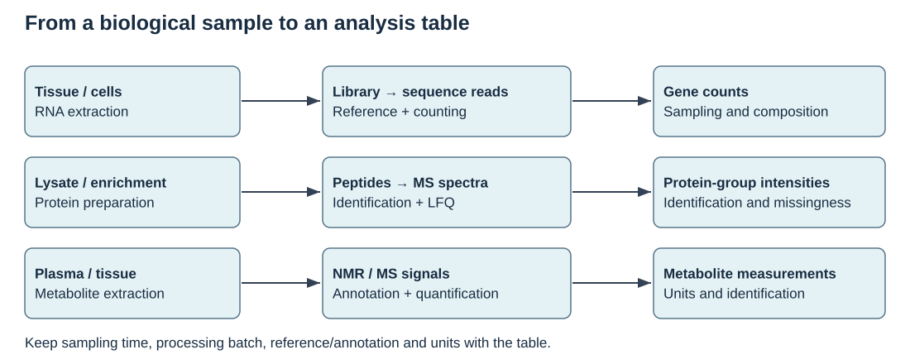

## Learning objectives

Distinguish peptide evidence, protein-group inference and abundance; evaluate missing values and transformations; interpret structural information without overclaiming function.

## Visualize the measurement chain



Use the [visual guide](../visual_guide.qmd) to explain the assumptions in this diagram. Analyze [actual protein-enrichment intensities](../tutorials/c02_proteomics.qmd) and investigate missingness.

## Biological question and measurements

Proteomics can quantify molecular evidence from peptides or proteins using platforms such as mass spectrometry. A measured peptide may be shared by multiple proteins; assigning it to a unique gene product is an inference problem. Identification confidence and abundance uncertainty are separate. Sample preparation, digestion, instrument response and batch effects influence measured values.

A protein table can contain missing values because abundance is low, a feature was not identified or processing failed. These mechanisms imply different analysis choices. Replacing every missing value by zero treats non-observation as a known measurement and can introduce artificial group differences. On a log scale, zero is not an absence: it represents an original-scale value of one.

Structural records describe coordinates of a measured or predicted molecular model. A geometrical contact suggests spatial proximity within that model; it does not alone establish biochemical interaction or functional importance.

## Model and assumptions

If $z=\log_2(x)$ for positive abundance x, a difference $z_T-z_C$ corresponds to a ratio $2^{z_T-z_C}$. The example compares arithmetic means of log2 measurements, so the ratio corresponds to geometric means on the original scale.

Complete-case comparisons require recording which values remain in each group. They can be biased when observation depends on abundance or group.

## Worked example

The inputs below are hypothetical. Run the example, predict one change, then compare your prediction with the result. All executable code uses base R.

```{r}
z <- c(8,8.5,NA,9,9.2,NA)
group <- factor(c("C","C","C","T","T","T"))
means <- tapply(z,group,mean,na.rm=TRUE)
observed <- tapply(!is.na(z),group,sum)
data.frame(group=names(means),observed=as.vector(observed),mean_log2=as.vector(means))
c(log2_difference=means["T"]-means["C"],
 geometric_mean_ratio=2^(means["T"]-means["C"]))
```

Both groups retain two measurements. The numerical ratio describes the observed log2 values, not a verified biological treatment effect.

## Identification and quantification are separate inferences

In bottom-up proteomics, proteins are digested into peptides and the instrument measures peptide-related ions. Matching spectra to candidate sequences produces identification evidence. Combining peptide evidence into proteins or protein groups is another inference. Shared peptides, isoforms and incomplete sequence coverage can prevent a unique assignment.

An identification FDR addresses a defined set of identifications at a stated level. It does not automatically control errors in differential-abundance tests performed later. Keep identification thresholds, protein-group rules and abundance inference separate in the analysis record.

| Stage | Output | Key interpretation question |
|---|---|---|
| Spectrum matching | Candidate peptide evidence | How was identification error assessed? |
| Protein inference | Protein or protein group | Are peptides unique or shared? |
| Quantification | Intensity or ratio | What scale and normalization apply? |
| Group comparison | Effect and uncertainty | What samples, missingness and model support it? |

## The scale determines the summary

Instrument response can span orders of magnitude. A log transformation makes multiplicative differences additive, but also changes the meaning of an average. An arithmetic mean on the original scale and a geometric mean need not agree. Report which one your model compares.

```{r}
x <- c(2,4,16)
c(arithmetic_mean=mean(x),geometric_mean=2^mean(log2(x)))
# A common multiplier becomes an additive shift in log2 units.
stopifnot(max(abs(log2(2*x)-log2(x)-1))<1e-12)
```

Sample scaling can address a defined technical reference, but must not erase a biological global shift merely because equal totals were assumed. The choice of normalization needs a biological and assay rationale.

## Missingness can depend on abundance

A low-abundance peptide is less likely to be detected in some acquisition settings. Other missing values reflect failed preparation, interference or identification. Thus a missing value can be informative, and one imputation rule need not suit every mechanism.

```{r}
set.seed(801)
true_log2 <- rnorm(1000,8,1)
observed <- true_log2
observed[true_log2<7.5] <- NA
c(full_mean=mean(true_log2),observed_mean=mean(observed,na.rm=TRUE),
 observed_fraction=mean(!is.na(observed)))
```

The detected subset has a higher mean by construction. Complete-case analysis and low-value imputation answer questions under different assumptions; neither restores the unobserved measurements without uncertainty. Record observation rates by group and examine sensitivity to plausible policies.

## Structure provides a complementary type of evidence

A coordinate model describes a conformation under its source conditions. Distance units, chain identity, missing residues and the representation chosen affect contact summaries. A C-alpha distance uses backbone representatives rather than all interacting atoms. A close pair can be geometrically interesting while lacking a demonstrated functional role.

Predicted structures also have confidence information that can vary across regions. A high-confidence local fold does not necessarily establish relative domain positioning, binding partners or the physiological state. Use structural evidence to formulate a testable hypothesis about an abundance or variant result, and keep those claims distinct.

::: {.callout-note collapse="true" title="Protein challenge"}
A shared peptide increases in the treatment group and matches two proteins. Can both proteins be declared independently increased? No. The evidence is ambiguous at that level. Report the group or unresolved assignment and identify unique evidence needed for separation.
:::

## Interpretation and scope

The teaching protein values are supplied log2 abundances. They are not raw spectra and do not implement peptide identification or protein inference. Report platform, processing, quantification scale, identification thresholds and missingness. Protein structure and abundance answer different questions.

## Exercises

1. What ratio corresponds to a log2 difference of one?
2. Why might low-value imputation strengthen a spurious difference?
3. Does a close residue pair establish an interaction in a living animal?

::: {.callout-note collapse="true" title="Suggested answers"}
1. Two.
2. If one group has more missing values, the imputation can manufacture a lower group mean; its assumptions need justification.
3. No; context, structural uncertainty and biological evidence are required.
:::

## Further reading

[EMBL-EBI proteomics bioinformatics materials](https://www.ebi.ac.uk/training/materials/proteomics-bioinformatics-materials/course-content/) provide complementary assay and analysis lessons. Use them to distinguish spectra, peptide evidence and protein-level claims.

## Practicals and course pathways

[Protein structure](../tutorials/p07_structure.qmd) and [proteomics analysis](../tutorials/p18_proteomics.qmd) address different measurements.

Use the [unified map](../course_map.qmd) to locate B08 in both harmonized outlines. Return to the [building-block index](../modules.qmd).
