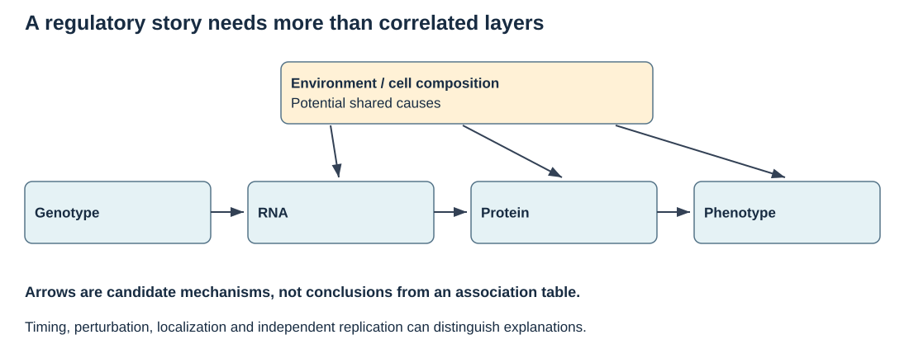

Use these original diagrams to explain an analysis before choosing software. Each figure includes a question, a suggested answer and links to the relevant lessons. SVG files can be enlarged without losing detail and have descriptive alternatives for readers using assistive tools.

## What does the assay measure?

The three pipelines produce different quantities. A gene count is sequencing evidence assigned to an annotation; an LFQ value summarizes identified protein groups; a metabolite measurement depends on signal processing and compound assignment. Sampling and processing metadata belong with every table.

**Explain it:** Which part of the pipeline can turn an apparent biological difference into a measurement difference?

::: {.callout-tip collapse="true" title="Suggested reasoning"}
Different preparation batches, reference annotations or sample degradation can change the table. Name the stage and the diagnostic you would examine.
:::

Continue with [B01](notes/b01_foundations.qmd), [B06](notes/b06_transcriptomics.qmd), [B08](notes/b08_proteomics.qmd), [B09](notes/b09_metabolomics.qmd).

## What is independently replicated?

In this hypothetical diagram, diet is assigned to pens. Animals and tubes are nested observations. One pen per diet cannot separate a diet effect from a pen effect. If allocation were instead independent at animal level, the design and appropriate unit would change.

**Explain it:** Does collecting two more tubes from each animal increase treatment replication?

::: {.callout-tip collapse="true" title="Suggested reasoning"}
It can improve measurement precision or permit a technical diagnostic, but it adds no independent allocation units. Replicate pens and record nesting.
:::

Continue with [B02](notes/b02_design.qmd), [P15](tutorials/p15_experimental_design.qmd).

## Why is library size not the whole normalization problem?

This hypothetical fixed-budget calculation assumes reads are sampled in proportion to molecules. Increasing C changes every share even when A and B have unchanged absolute amounts. Stable-reference normalization can recover relative shifts under its assumptions; it cannot identify a universal per-cell RNA increase from relative counts alone.

**Explain it:** What extra measurement would help investigate a global shift in RNA per cell?

::: {.callout-tip collapse="true" title="Suggested reasoning"}
A suitable external reference or calibrated spike-in strategy, with known sampling and preparation, can supply information absent from relative counts. Its own technical assumptions still need checking.
:::

Continue with [B06](notes/b06_transcriptomics.qmd), [P09](tutorials/p09_rnaseq.qmd), [Case 1](tutorials/c01_airway.qmd).

## What would establish a regulatory relationship?

The horizontal arrows are a candidate mechanistic story. The upper shared causes show why RNA, protein and phenotype can correlate without identifying that story. Feedback and measurement timing can complicate it further.

**Explain it:** If RNA and protein correlate, have you established RNA-mediated genetic control of the phenotype?

::: {.callout-tip collapse="true" title="Suggested reasoning"}
No. You need evidence that distinguishes shared causes, temporal ordering and the relevant perturbation. A measured correlation can support a follow-up hypothesis.
:::

Continue with [B07](notes/b07_epigenomics.qmd), [B13](notes/b13_association.qmd), [P29](tutorials/p29_association.qmd).

## Where do we combine information?

Early, intermediate and late integration combine different objects. A representation learned across assays may explain shared variation, but its scale, missingness assumptions and intended use must be explicit. Predictive comparisons need the same held-out observations and target.

**Explain it:** Can a shared latent factor be interpreted as a biological pathway automatically?

::: {.callout-tip collapse="true" title="Suggested reasoning"}
No. Inspect its contributing features, batch/phenotype associations and stability; support a pathway claim with appropriate independent evidence.
:::

Continue with [B15](notes/b15_integration.qmd), [P21](tutorials/p21_integration.qmd), [Case 3](tutorials/c03_cattle.qmd).

## When may the test set influence the model?

The split must represent the intended future use. Every fitted preprocessing step and tuning decision belongs within training; validation folds repeat those steps. The final test set receives frozen choices. Random animals from the same farm answer a different transfer question from a new farm.

**Explain it:** Why can fitting scaling or outcome-based feature selection before the split inflate accuracy?

::: {.callout-tip collapse="true" title="Suggested reasoning"}
It lets held-out observations influence fitted choices. Outcome-based selection is direct leakage; scaling also reveals properties of the held-out distribution. Fit each operation in the training fold and apply its stored parameters.
:::

Continue with [B12](notes/b12_statistics.qmd), [P20](tutorials/p20_prediction.qmd), [P23](tutorials/p23_integrated_analysis.qmd).

## From a static figure to movement

For a first dynamic example, run the production–degradation model in [B14](notes/b14_networks.qmd): change the production rate, degradation rate and starting amount separately, then predict both the equilibrium and time to approach it before inspecting the curve. The [media guide](media.qmd) adds molecular animations and lectures on feedback. A useful animation should expose the biological assumptions as clearly as the movement.
